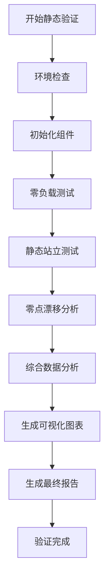

# Unitree Go2 足端力传感器验证框架

## 🎯 项目概述

本项目为Unitree Go2四足机器人的足端力传感器提供全面的验证框架，确保传感器系统的准确性、稳定性和可靠性。验证框架采用模块化设计，支持多种验证场景和分析方法。

## 📁 项目结构

```
foot_force_validation/
├── 📄 README.md                     # 项目文档
├── ⚙️ validation_config.json        # 配置文件
├── 📊 basic_test.py                 # 基础测试脚本
├── 🔧 static_validation.py          # 静态验证主脚本 [NEW]
├── 📋 foot_force_config.py          # 足端力配置模块
├── 💾 data_collector.py             # 数据收集模块
├── 🧪 static_tester.py              # 静态测试器 [NEW]
├── 📈 analyzer.py                   # 数据分析器 [NEW]
├── 🎨 visualizer.py                 # 可视化模块 [NEW]
├── 📁 logs/                         # 日志目录
└── 📁 output/                       # 输出目录
```

## 🚀 快速开始

### 阶段A: 数据读取框架 ✅ (已完成)

基础数据采集和处理能力：

```bash
# 运行基础测试
./run_basic_test.sh

# 或直接运行Python脚本
python3 basic_test.py
```

### 阶段B: 静态力分布验证 🔥 (当前阶段)

静态条件下的传感器验证：

```bash
# 运行静态验证交互式界面
cd /path/to/foot_force_validation
../run_static_validation.sh

# 或直接运行完整静态验证
python3 static_validation.py --config validation_config.json

# 快速测试模式（缩短测试时间）
python3 static_validation.py --config validation_config.json --test-mode

# 自定义参数
python3 static_validation.py --config validation_config.json --log-level DEBUG --skip-visualization
```

## 🔧 静态验证详细说明

### 验证项目

#### 1. 零负载测试 🔧
- **目的**: 验证传感器零点准确性和偏移量
- **条件**: 机器人完全悬空，足端不接触任何表面
- **测试内容**:
  - 零点数值验证
  - 传感器偏移分析
  - 噪声水平测量
  - 四足端一致性检查

#### 2. 静态站立测试 🤖
- **目的**: 验证静态负载下的力分布准确性
- **条件**: 机器人正常站立，四足平稳接触地面
- **测试内容**:
  - 总重量测量准确性
  - 四足重量分布分析
  - 重心位置计算
  - 负载平衡评估

#### 3. 零点漂移分析 📊
- **目的**: 评估传感器长时间稳定性
- **条件**: 机器人保持悬空状态
- **测试内容**:
  - 长时间零点稳定性
  - 温度漂移分析
  - 时域稳定性评估
  - 漂移速率计算

#### 4. 综合数据分析 📈
- **内容**:
  - 统计分析（均值、方差、分布等）
  - 频域分析（功率谱、频率特性）
  - 异常检测（离群值、突变点）
  - 相关性分析（四足端响应一致性）
  - 趋势分析（漂移趋势、稳定性）

#### 5. 可视化报告 🎨
- **输出**:
  - 实时数据图表
  - 静态分析图表
  - 3D力分布图
  - 验证汇总仪表板
  - 综合评估报告

### 验证流程



## 🛠️ 配置说明

### validation_config.json 主要配置项

```json
{
  "static_validation": {
    "zero_load_test_duration": 30.0,        // 零负载测试时间(秒)
    "static_standing_duration": 60.0,       // 静态站立测试时间(秒)
    "zero_drift_duration": 300.0,           // 零点漂移分析时间(秒)
    "expected_total_force": 150.0,          // 期望总重量(N)
    "weight_distribution_tolerance": 15.0,   // 重量分布容差(%)
    "zero_offset_threshold": 2.0,           // 零点偏移阈值(N)
    "drift_rate_threshold": 0.1,            // 漂移速率阈值(N/min)
    "noise_level_threshold": 0.5             // 噪声水平阈值(N)
  },
  "analysis": {
    "outlier_threshold": 3.0,               // 异常检测阈值
    "frequency_bands": {                    // 频段分析配置
      "dc": [0, 1],
      "low": [1, 10],
      "mid": [10, 50],
      "high": [50, 100]
    }
  }
}
```

## 📊 输出文件说明

### 验证报告
- `static_validation_final_report_YYYYMMDD_HHMMSS.json` - 最终验证报告
- `comprehensive_analysis_YYYYMMDD_HHMMSS.json` - 综合分析报告

### 数据文件
- `static_validation_data_YYYYMMDD_HHMMSS.csv` - 原始数据导出
- 日志文件位于 `logs/` 目录

### 可视化图表
- `static_analysis_YYYYMMDD_HHMMSS.png` - 静态分析图表
- `force_distribution_3d_YYYYMMDD_HHMMSS.png` - 3D力分布图
- `validation_dashboard_YYYYMMDD_HHMMSS.png` - 验证汇总仪表板

## 🎯 评分标准

### 验证项目评分 (0-100分)

#### 零负载测试
- **90-100分**: 零点偏移 < 1N，噪声 < 0.3N，一致性 > 95%
- **80-89分**: 零点偏移 < 2N，噪声 < 0.5N，一致性 > 90%
- **70-79分**: 零点偏移 < 3N，噪声 < 1N，一致性 > 85%
- **<70分**: 超出阈值，需要重新校准

#### 静态站立测试
- **90-100分**: 重量误差 < 5%，分布均匀性 > 90%
- **80-89分**: 重量误差 < 10%，分布均匀性 > 80%
- **70-79分**: 重量误差 < 15%，分布均匀性 > 70%
- **<70分**: 超出阈值，需要检查安装

#### 零点漂移分析
- **90-100分**: 漂移率 < 0.05N/min，稳定性 > 95%
- **80-89分**: 漂移率 < 0.1N/min，稳定性 > 90%
- **70-79分**: 漂移率 < 0.2N/min，稳定性 > 85%
- **<70分**: 漂移过大，需要温控或重新校准

### 总体评估标准
- **PASS (≥85分且通过率≥80%)**: 传感器验证通过，可投入使用
- **WARNING (≥70分且通过率≥60%)**: 基本通过，建议优化
- **FAIL (<70分或通过率<60%)**: 验证失败，需要维修或校准

## 🔍 故障排除

### 常见问题

#### 1. 环境检查失败
```bash
# 安装Python依赖
pip3 install numpy scipy matplotlib pandas

# 检查Unitree SDK
python3 -c "from unitree_sdk2py.core.channel import ChannelSubscriber"
```

#### 2. 传感器连接问题
- 检查网络连接: `ping 192.168.123.161`
- 验证DDS通信: 查看日志文件详细错误信息
- 重启机器人网络服务

#### 3. 数据质量问题
- 确保测试环境安静，无振动干扰
- 检查机器人安装是否牢固
- 验证传感器校准状态

#### 4. 磁盘空间不足
```bash
# 清理旧文件
cd foot_force_validation
find output/ -name "*.png" -mtime +7 -delete
find logs/ -name "*.log" -mtime +30 -delete
```

### 调试模式

启用详细日志进行问题诊断：

```bash
python3 static_validation.py --config validation_config.json --log-level DEBUG
```

## 📈 使用建议

### 验证频率
- **首次部署**: 完整静态验证
- **定期维护**: 每月快速测试
- **故障排查**: 特定项目验证
- **系统升级**: 重新完整验证

### 测试环境要求
- 安静的测试环境（避免振动）
- 稳定的地面（用于静态站立测试）
- 足够的悬空空间（用于零负载测试）
- 稳定的网络连接

### 数据管理
- 定期备份验证报告
- 保留历史数据用于趋势分析
- 及时清理临时文件释放空间

## 🔮 后续开发计划

### 阶段C: 动态负载验证 (计划中)
- 步态过程中的力分布验证
- 动态负载下的传感器响应
- 运动过程中的数据一致性

### 阶段D: 校准与补偿 (计划中)
- 自动校准算法
- 温度补偿机制
- 动态零点调整

### 阶段E: 实时监控 (计划中)
- 实时数据流监控
- 异常自动检测
- 预警系统集成

## 📞 技术支持

### 文档资源
- 📖 详细使用文档: 查看本README
- 🐛 问题诊断: 检查 `logs/` 目录
- 📊 验证报告: 查看 `output/` 目录

### 联系方式
- 项目仓库: [GitHub链接]
- 技术讨论: [论坛链接]
- 问题反馈: [Issue链接]

---

*版本: v2.0.0*  
*更新时间: 2025-06-27*  
*支持平台: Unitree Go2* 